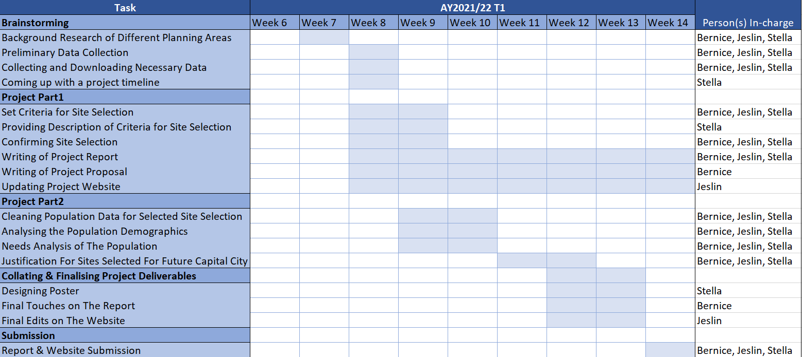

# <span style="font-family:DM Sans;color:#2E6173;font-size:1.5em;">Title: Finding Capital City</span>


## <span style="font-family:DM Sans;color:#2E6173;font-size:1em;">Project Summary</span>
Our team is looking at proposing a site for the new capital city based on the accessibility, land suitability, safety (far away from disaster prone areas) while reducing environmental damage and cost.  

## <span style="font-family:DM Sans;color:#2E6173;font-size:1em;">Project Proposal</span>

### <span style="font-family:DM Sans;color:#2E6173;font-size:0.8em;">Motivation of Project</span>
The goal of this project is to determine the suitable site of the new capital city in the predetermined area that is in part of Kutai Kartanegara and Penajam Paser Utara regency. Utilising geospatial analysis methods as well as geographic information systems, we aim to derive potential suitable sites for the new capital city after taking into account important factors that should be considered when choosing the optimal location of a capital city. We believe that performing a geospatial analysis ensures a more informed decision-making process which is extremely important considering the outcome could greatly affect the prosperity of Indonesia and the lives of many Indonesians.  

### <span style="font-family:DM Sans;color:#2E6173;font-size:0.8em;">Project Objective</span>

#### <span style="font-family:DM Sans;color:#2E6173;font-size:0.75em;">Task 1</span>
Prepare a report of survey to be submitted to the National Development Agency including data relating to

* Population and Demographic
* Economic and Businesses
* Transport and Communication
* Infrastructure
* Environment and Hazard

#### <span style="font-family:DM Sans;color:#2E6173;font-size:0.75em;">Task 2</span>
Select a suitable site for the proposed new capital city using the criteria below:

* 4500 to 5500 hectares in size
* Flat lands preferred 
* Far away from potential natural disaster risk areas
* Close proximity to existing urban settlement areas
* Avoid natural forests
* Avoid areas prone to forest fire.
* Highly accessible (road transport, airports and seaports)

#### <span style="font-family:DM Sans;color:#2E6173;font-size:0.75em;">Study Area</span>
For this project, we will be looking at the East Kalimantan Province and it's cities - Kota Balikpapan, Kota Samarinda, Penajam Paser Utara and Kutai Kartanegara.


#### <span style="font-family:DM Sans;color:#2E6173;font-size:0.75em;">Scope of Work</span>
This list is not exhaustive: 

* Selection of project area, this year the project area is provided.
* Data collection, extraction, integration, transformation and wrangling.
* Designing and building GIS model and database
* Preparing report of survey
* Performing site suitability analysis by integrating GIS and multi-criteria evaluation methods.
* Preparing site suitability analysis report including detail discussion of the analysing method used.
* Preparing poster and project webpage.

## <span style="font-family:DM Sans;color:#2E6173;font-size:1em;">Project Timeline</span>



## <span style="font-family:DM Sans;color:#2E6173;font-size:1em;">Data Source</span>
```{r table2, echo=FALSE, message=FALSE, warnings=FALSE, results='asis'}
tabl <- "  
| Data source   | Data Format   |     Description            |                 Link                |
|---------------|:-------------:|-----------------------------------:|-------------:|
|indonesia-geospasial.com   | Shapefiles | Batas Desa & Data Kependudukan Tahun 2019 Seluruh Indonesia| https://www.indonesia-geospasial.com/2020/04/download-shapefile-shp-batas-desa.html          |  
|indonesia-geospasial.com    | Shapefiles      |RBI Provinsi Kalimantan Timur Perwilayah (Kabupaten/Kota) | https://www.indonesia-geospasial.com/2020/01/shp-rbi-provinsi-kalimantan-timur.html    |     
|indonesia-geospasial.com |   TIF Files   |  DEM SRTM 30m, digital elevation model at 30m resolution | https://www.indonesia-geospasial.com/2020/01/download-dem-srtm-30-meter-se-indonesia.html |  
|indonesia-geospasial.com |   Shapefiles   |  Geological data layer  | https://www.indonesia-geospasial.com/2020/03/download-data-shapefile-shp-geologi-se.html |
|indonesia-geospasial.com |   Shapefiles   |  Forest fire hot spot data  | https://www.indonesia-geospasial.com/2020/04/shapefile-shp-titik-api-hotspot.html |  
|indonesia-geospasial.com |   Shapefiles   |  Buildings and Settlements  | https://www.indonesia-geospasial.com/2020/12/download-shp-pemukiman-detail-seluruh.html |

"
cat(tabl)


```{r setup, include=FALSE}
knitr::opts_chunk$set(echo = FALSE)

