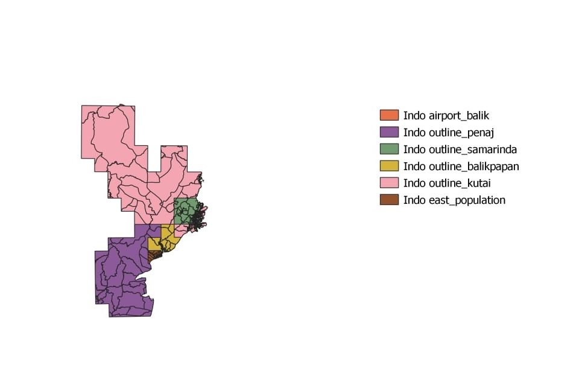
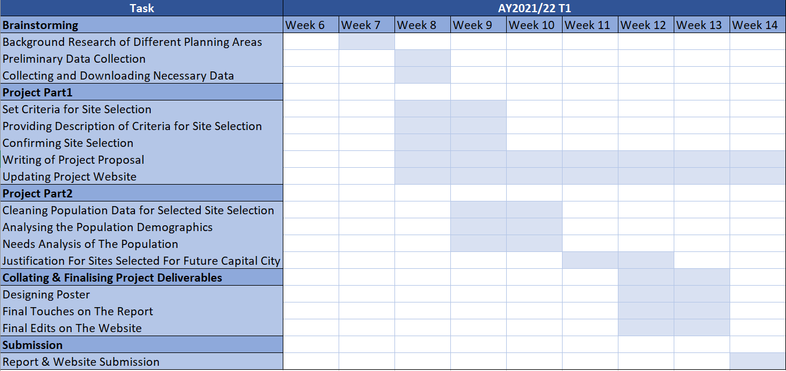

# Title: Finding Capital City

## Project Summary
Our team is looking at proposing a site for the new capital city based on the accessibility, land suitability, safety (far away from disaster prone areas) while reducing environmental damage and cost.  

## Project Proposal

### Motivation of Project
We are interested to know how the Indonesian government deems an area fit for capital relocation, and the complexity behind such a decision. Singapore shares close bilateral ties with Indonesia, with Singapore being one of its major foreign investors since 2014. Hence, the decision to relocate Indonesia's capital to East Kalimantan is of high interest to Singapore. 

### Project Objective

#### Task 1
Prepare a report of survey to be submitted to the National Development Agency including data relating to

* Population and Demographic
* Economic and Businesses
* Transport and Communication
* Infrastructure
* Environment and Hazard

#### Task 2
Select a suitable site for the proposed new capital city using the criteria below:

* 4500 to 5500 hectares in size
* Flat lands preferred 
* Far away from potential natural disaster risk areas
* Close proximity to existing urban settlement areas
* Avoid natural forests
* Avoid areas prone to forest fire.
* Highly accessible (road transport, airports and seaports)

#### Study Area
For this project, we will be looking at the East Kalimantan Province and it's cities - Kota Balikpapan, Kota Samarinda, Penajam Paser Utara and Kutai Kartanegara.



#### Scope of Work
This list is not exhaustive: 

* Selection of project area, this year the project area is provided.
* Data collection, extraction, integration, transformation and wrangling.
* Designing and building GIS model and database
* Preparing report of survey
* Performing site suitability analysis by integrating GIS and multi-criteria evaluation methods.
* Preparing site suitability analysis report including detail discussion of the analysing method used.
* Preparing poster and project webpage.

## Project Timeline



## Data Source
```{r table2, echo=FALSE, message=FALSE, warnings=FALSE, results='asis'}
tabl <- "  
| Data source   | Data Format   |     Description            |                 Link                |
|---------------|:-------------:|-----------------------------------:|-------------:|
|indonesia-geospasial.com   | Shapefiles | Batas Desa & Data Kependudukan Tahun 2019 Seluruh Indonesia| https://www.indonesia-geospasial.com/2020/04/download-shapefile-shp-batas-desa.html          |  
|indonesia-geospasial.com    | Shapefiles      |RBI Provinsi Kalimantan Timur Perwilayah (Kabupaten/Kota) | https://www.indonesia-geospasial.com/2020/01/shp-rbi-provinsi-kalimantan-timur.html    |     
|indonesia-geospasial.com |   TIF Files   |  DEM SRTM 30m, digital elevation model at 30m resolution | https://www.indonesia-geospasial.com/2020/01/download-dem-srtm-30-meter-se-indonesia.html |  
|indonesia-geospasial.com |   Shapefiles   |  Geological data layer  | https://www.indonesia-geospasial.com/2020/03/download-data-shapefile-shp-geologi-se.html |
|indonesia-geospasial.com |   Shapefiles   |  Forest fire hot spot data  | https://www.indonesia-geospasial.com/2020/04/shapefile-shp-titik-api-hotspot.html |  
|indonesia-geospasial.com |   Shapefiles   |  Buildings and Settlements  | https://www.indonesia-geospasial.com/2020/12/download-shp-pemukiman-detail-seluruh.html |

"
cat(tabl)


```{r setup, include=FALSE}
knitr::opts_chunk$set(echo = FALSE)

